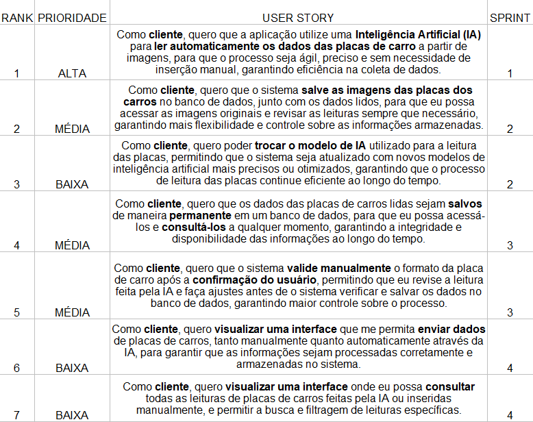
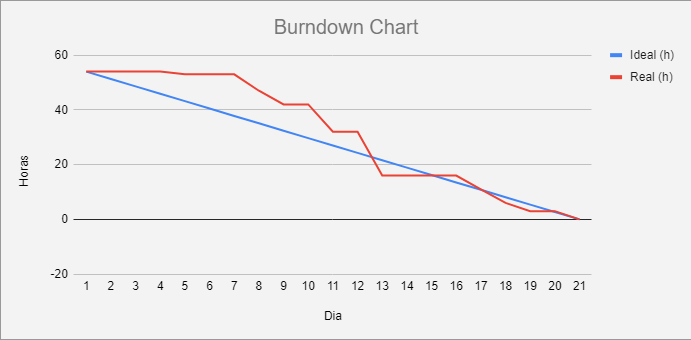
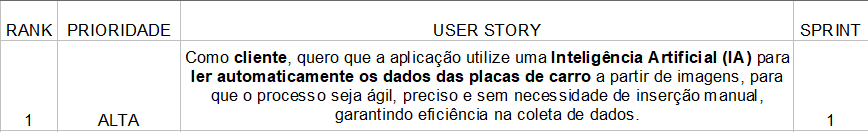
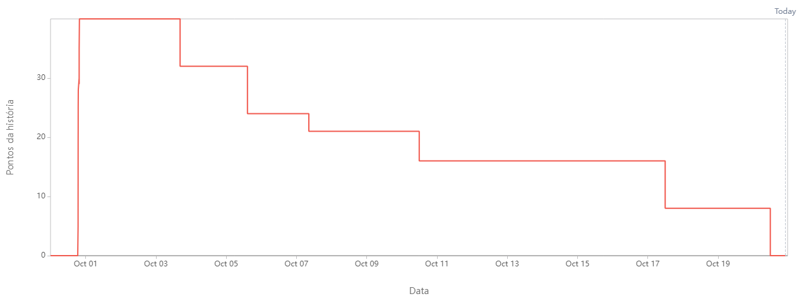
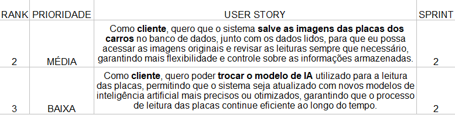

# API-2

Projeto de API - 2° Semestre de 2024 da Fatec São José dos Campos - BUG BUSTERS

Projeto sobre uma interface gráfica utilizando Java que conecta-se com um banco de dados para a interação com documentos.

| Cliente          | Periodo/Curso                                  | Professor M2      | Professor P2     | Contato Cliente                    |
| ---------------- | ---------------------------------------------- | ----------------- | ---------------- | ---------------------------------- |
| Giuliano Bertoti | 2º ADS (Análise e Desenvolvimento de Sistemas) | Cláudio Etelvino  | Giuliano Bertoti | <giuliano.bertoti@fatec.sp.gov.br> |

## Índice

- [API 2](#API-2)
  - [Índice](#índice)
  - [Cronograma e Sprints](#cronograma-e-sprints)
    - [Sprint 1. Produto Mínimo Viável](#sprint-1-produto-mínimo-viável)
    - [Sprint 2](#sprint-2)
  - [Competências desenvolvidas](#competências-desenvolvidas)
    - [Hard Skills](#hard-skills)
    - [Soft Skills](#soft-skills)
  - [Tecnologias Utilizadas](#tecnologias-utilizadas)
  - [Documentos](#documentos)
  - [Autores](#autores)

## Cronograma e Sprints

| Sprint            | Previsão   | Status       |
| ----------------- | ---------- | ------------ |
| Kick Off          | 29/08/2024 | Concluído    |
| 01                | 09/09/2024 | Concluída    |
| 02                | 30/09/2024 | Concluída    |
| 03                | 21/10/2024 | Em progresso |
| 04                | 11/11/2024 | A fazer      |
| Feira de Soluções | 12/12/2024 | A fazer      |

### Sprint 1. Produto Mínimo Viável

- [x] Interface simplificada;
- [x] Leitura de placas de carro;
- [x] Opções de modelo de IA.

### Sprint 2. Produto Mínimo Viável

- [x] Escolha de modelos
- [x] Variedade de informações
- [x] Interface mais elaborada

## Competências desenvolvidas

### Hard Skills

Hard skills desenvolvidas

- Habilidades analíticas;
- Conhecimento em ferramentas;
  - Intellij
  - Netbeans
  - Ollama
  - MySQL
  - Java
  - Git e GitHub
- Gestão de projetos;
- Competências técnicas;

### Soft Skills

Soft skills desenvolvidas

- Resolução de conflitos;
- Adaptabilidade;
- Comunicação;
- Trabalho em equipe.

## Tecnologias Utilizadas

<!--  -->

- Google Sheets
- Figma
- Git e GitHub
- Intellij
- Netbeans
- Java
- Ollama
- MySQL
- Draw.io
- Markdown

## Documentos

### Backlog do Produto

## Sprint 1

### Gráfico Burndown

### Backlog da Sprint

## Sprint 2

### Gráfico Burndown

### Backlog da Sprint

<!-- ## Veja Também

[Como Contribuir](./CONTRIBUTING.md) para você que quer contribuir no desenvolvimento desse projeto.

[Manual do Usuário](./docs/manual.md) para você que quer entender como utilizar o nosso site. -->

## Autores

|    Função     | Nome             |                                                                                                                                               GitHub |
| :-----------: | :--------------- | ---------------------------------------------------------------------------------------------------------------------------------------------------: |
| Product Owner | Gabriel Viell       |    |
| Scrum Master  | Vinicius Elias      |               |
|  Team Member  | Allan Couto         |              |
|  Team Member  | Davi Miyake         |               |
|  Team Member  | Diego Castilho      |                |
|  Team Member  | Humberto Ishii      |           |
|  Team Member  | Wesley Gonçalves    |         |

